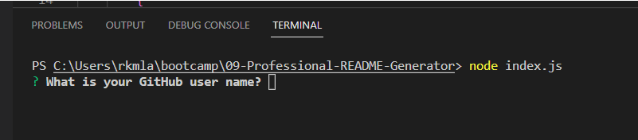
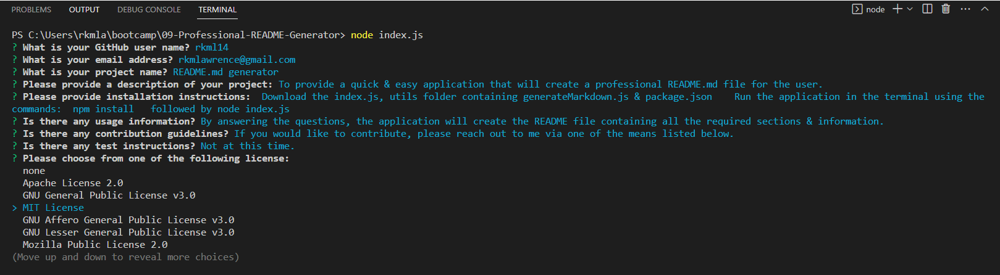
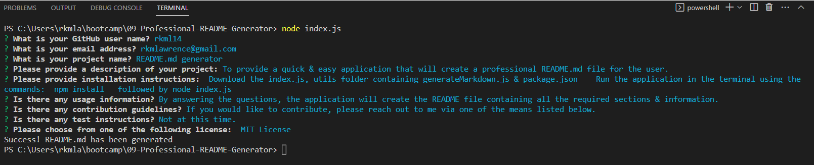
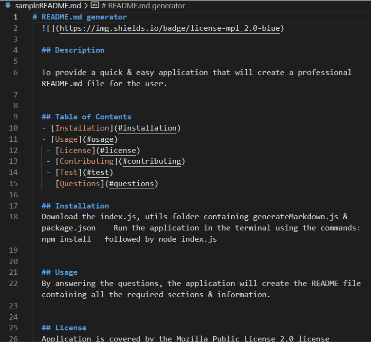

# Professional README.MD Generator

## Description

This application allows the user to create a high-quality README for their application that they have created as an open source project on GitHub.   
By providing details regarding their GitHub profile, email address, Project Name along with further details regarding the Project (description, installation instructions, usage information, contribution guidelines and test instructions) and picking out which license they would prefer to use; the application will create a professional README.md file.  

My motivation was to build an application that would allow for easy and rapid creation of a README.md  for future projects to be stored in my GitHub repository.  This will allow for consistent README.md files across all my projects.  

Things I learned from this application:
- package.json
- inquirier.prompt and adding values to choices to expand the usable data 
- learned about tying required packages to an application 
- modularization 
- using temperate literals
- using ternary operators
- learning Write - File in javascript
- keeping my code DRY

  ## Table of Contents 
  - [Installation](#installation)
  - [Usage](#usage)
   - [License](#license)
   - [Contributing](#contributing)
   - [Test](#test)
   - [Questions](#questions)

## Installation

The following images provide a walkthrough on how to use the application.

Download the index.js, the utils folder containing generateMarkdown.js and package.json   

Run the application via the terminal using the command prompt: node index.js  

## Usage

In the terminal, using the command prompt: node index.js 

The list of questions is asked of the user, along with a choice of licenses to pick from:

Once the questions are answered, the sampleREADME is generated and a confirmation message of "Success! README.md has been generated" is displayed in the terminal

The sample README in markdown language can be viewed:

An animation demonstrating the steps of the application and the created readme in markdown & preview:

## Contributing
If you would like to contribute to this application, please reach out to me via one of the means listed under Questions.

## Tests 
None at this time

## Credits

Cassandra Watson https://github.com/cassiewatsonn 

## License

MIT License 

## Questions

If you have any questions regarding this application, please contact me via one of the means below:
Rebecca Lawrence  https://github.com/rkml14
rkmlawrence@gmail.com  